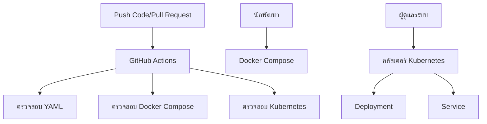

# DevOps Lab: CI/CD Pipeline ด้วย Docker และ Kubernetes

โครงการนี้แสดงให้เห็นถึงกระบวนการทำงานแบบ DevOps อย่างครบวงจรโดยใช้ GitHub Actions, Docker Compose และ Kubernetes

## โครงสร้างของโครงการ

```
.
├── .github/
│   └── workflows/
│       └── ci.yml          # GitHub Actions workflow
├── k8s/
│   ├── deployment.yml      # Kubernetes deployment
│   └── service.yml         # Kubernetes service
├── docker-compose.yml      # กำหนดค่า Docker Compose
└── README.md               # ไฟล์นี้
```

## GitHub Actions Workflow (ci.yml)

### ทำไมต้องใช้ `on: push` และ `on: pull_request`?

- `on: push`: ใช้สำหรับเรียกใช้งาน workflow เมื่อมีการ push code ไปยัง repository ซึ่งช่วยให้ทุกการเปลี่ยนแปลงถูกตรวจสอบและทดสอบโดยอัตโนมัติ
- `on: pull_request`: ใช้สำหรับเรียกใช้งาน workflow เมื่อมีการสร้างหรืออัปเดต pull request ซึ่งช่วยให้ได้ feedback ทันทีก่อนที่จะ merge การเปลี่ยนแปลงไปยัง branch หลัก

การใช้ทั้งสองเหตุการณ์นี้ช่วยให้มั่นใจได้ว่าการผสานรวมอย่างต่อเนื่องและการควบคุมคุณภาพจะเกิดขึ้นในหลายจุดของกระบวนการทำงาน

### Jobs และ Steps ทำหน้าที่อะไร?

- **Jobs**: หน่วยการทำงานอิสระที่ทำงานแบบขนานกันโดยค่าเริ่มต้น โดยแต่ละ job จะทำงานใน instance ใหม่ของสภาพแวดล้อมเสมือน
- **Steps**: งานที่ทำงานตามลำดับในแต่ละ job โดยแต่ละ step สามารถรันคำสั่งหรือใช้ actions ได้

ใน workflow ของเรา:
1. `checkout` - ดึง source code จาก repository
2. `lint-yaml` - ตรวจสอบไวยากรณ์ของไฟล์ YAML ทั้งหมด
3. `validate-docker-compose` - ตรวจสอบความถูกต้องของไฟล์ Docker Compose
4. `validate-kubernetes` - ตรวจสอบความถูกต้องของ manifest ของ Kubernetes

## Docker Compose (docker-compose.yml)

### อธิบายส่วนประกอบต่างๆ

- **services**: กำหนด container ที่จะทำงานเป็นส่วนหนึ่งของแอปพลิเคชันนี้
- **ports**: ทำ mapping port ระหว่างเครื่องโฮสต์กับ container
- **volumes**: จัดเก็บข้อมูลอย่างถาวรและแชร์ไฟล์ระหว่างโฮสต์กับ container
- **environment**: กำหนด environment variables ภายใน container

### Docker Compose ทำงานร่วมกับ Project อย่างไร?

Docker Compose ช่วยให้เราสามารถกำหนดและรันแอปพลิเคชัน Docker แบบ multi-container ได้ ในโครงการนี้จะสร้าง:
1. Web service ด้วย nginx
2. Database service ด้วย MySQL

ด้วยคำสั่งเดียว (`docker-compose up`) ทั้งสอง service จะเริ่มทำงานพร้อมการกำหนดค่าและ network settings ที่ถูกต้อง

## การกำหนดค่า Kubernetes

### Deployment (k8s/deployment.yml)

- **Deployment**: ออบเจกต์ของ Kubernetes ที่จัดการ ReplicaSets และประกาศสถานะที่ต้องการ
- **replicas**: จำนวน instance ของ pod ที่ต้องการรัน (ในกรณีนี้คือ 2)
- **selector**: ระบุว่า pods ใดที่ถูกจัดการโดย deployment นี้
- **template**: กำหนด template ของ pod ที่ใช้ในการสร้าง pods ใหม่

### Service (k8s/service.yml)

- **Service**: การนามธรรมที่กำหนดชุด pods ที่เป็นตรรกะและนโยบายในการเข้าถึง
- **port**: port ที่ service เปิดให้เข้าถึงภายใน
- **targetPort**: port บน pod ที่ service ส่ง traffic ไปยัง

### ความสัมพันธ์ระหว่าง Deployment และ Service

Deployment สร้างและจัดการ pods ของ nginx ในขณะที่ Service จัดหา endpoint ของเครือข่ายที่มั่นคงเพื่อเข้าถึง pods เหล่านั้น Service ใช้ label selectors เพื่อระบุ pods ที่จะส่ง traffic ไปยัง ซึ่งเชื่อมต่อกับ pods ที่ถูกสร้างโดย Deployment

## การทำงานร่วมกันของไฟล์ YAML แต่ละไฟล์

1. **GitHub Actions Workflow** (ci.yml): ตรวจสอบความถูกต้องของการกำหนดค่าทั้งหมดโดยอัตโนมัติเมื่อมีการ push code หรือสร้าง pull request
2. **Docker Compose** (docker-compose.yml): จัดเตรียมสภาพแวดล้อม development ด้วย web และ database services
3. **Kubernetes** (k8s/*.yml): จัดวางแอปพลิเคชันไปยัง Kubernetes cluster ที่คล้าย production

## ลำดับขั้นตอนเมื่อ Push โค้ดไปที่ GitHub

เมื่อมีการ push code ไปยัง GitHub:

1. **GitHub Actions Workflow** จะเริ่มทำงานอัตโนมัติ
   - ดึง source code
   - ตรวจสอบไวยากรณ์ไฟล์ YAML ทั้งหมด
   - ตรวจสอบความถูกต้องของ Docker Compose
   - ตรวจสอบความถูกต้องของ Kubernetes manifests
2. **Docker Compose** สามารถใช้สำหรับ development และ testing ภายในเครื่อง
3. **Kubernetes** ใช้สำหรับ production deployments

## แผนภาพแสดงความสัมพันธ์



Workflow นี้ช่วยให้มั่นใจได้ว่าการกำหนดค่าทั้งหมดถูกตรวจสอบก่อนการจัดวาง และจัดเตรียมสภาพแวดล้อมหลายระดับสำหรับ development, testing และ production.
